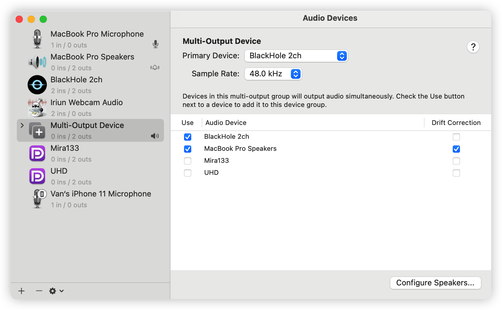
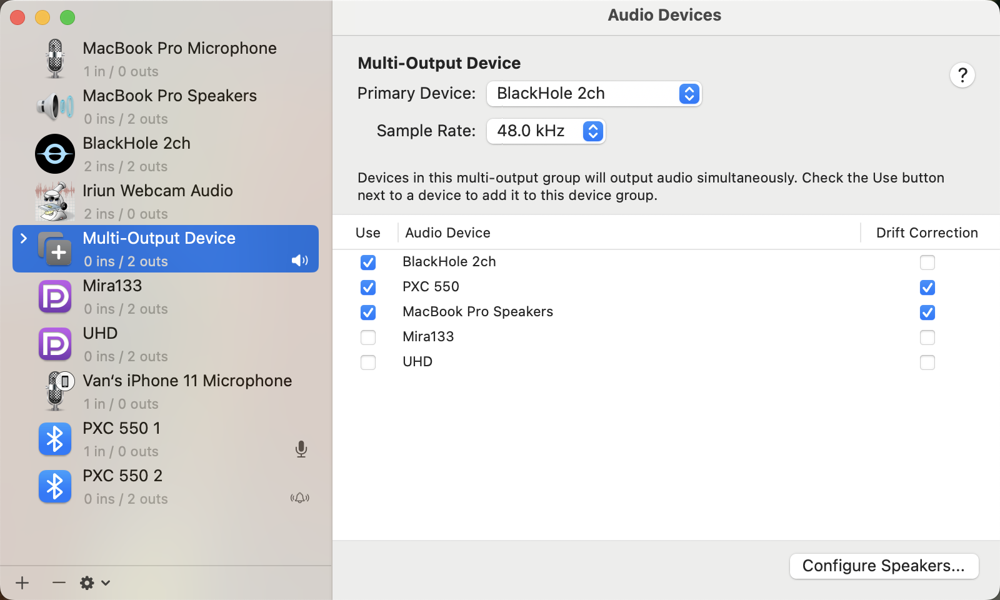
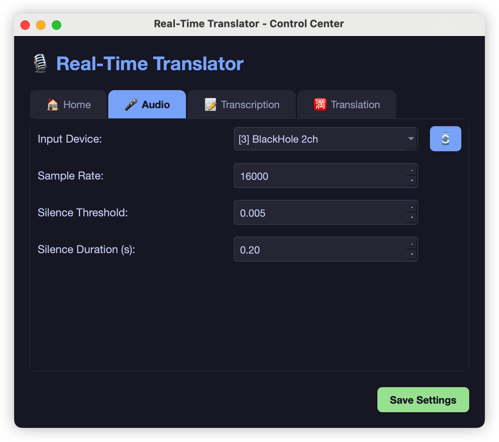

# Hướng dẫn cài BlackHole (macOS)

BlackHole là **driver âm thanh ảo** — cho phép app **nghe tiếng đang phát trên Mac** (YouTube, Zoom, trình duyệt…) mà không cần micro. Chỉ cần trên **macOS**; Windows dùng VB-CABLE (xem README).

---

## Bạn cần BlackHole khi nào?

| Mục đích | Cần BlackHole? |
|----------|----------------|
| Video YouTube / họp Zoom **phát ra loa** → app hiện chữ | **Có** |
| Chỉ nói vào **mic laptop** | **Không** (chọn mic trong tab Âm thanh) |

---

## Bước 1 — Cài BlackHole

### Cách A — Homebrew (khuyến nghị nếu đã có Brew)

```bash
brew install blackhole-2ch
```

Sau khi cài, **khởi động lại Mac** (hoặc đăng xuất/đăng nhập) để driver có hiệu lực.

### Cách B — Tải trực tiếp

1. Mở [existential.audio/blackhole](https://existential.audio/blackhole/)
2. Tải **BlackHole 2ch** (đủ cho hầu hết trường hợp)
3. Mở file `.pkg` và cài theo hướng dẫn
4. Khởi động lại Mac

### Kiểm tra đã cài

- **Cài đặt hệ thống → Âm thanh** → mục **Đầu ra** hoặc **Đầu vào** có **BlackHole 2ch**, hoặc
- Terminal:

```bash
ls "/Library/Audio/Plug-Ins/HAL/BlackHole2ch.driver"
```

Thấy thư mục `BlackHole2ch.driver` là đã cài.

---

## Bước 2 — Tạo Multi-Output (vừa nghe loa vừa bắt âm)

Nếu chỉ chọn **BlackHole** làm đầu ra → **bạn sẽ không nghe được** tiếng loa. Cần gộp **Loa MacBook** (hoặc tai nghe) **+ BlackHole**.

### 2.1 Mở Audio MIDI Setup

- **Spotlight** (`Cmd + Space`) → gõ **Audio MIDI Setup** → Enter, hoặc  
- **Ứng dụng → Tiện ích → Audio MIDI Setup**



### 2.2 Tạo thiết bị Multi-Output

1. Góc **dưới trái** cửa sổ, bấm nút **+**
2. Chọn **Create Multi-Output Device**
3. Bên phải, **tick** (bật) cả hai:
   - **MacBook … Speakers** (hoặc tai nghe bạn đang dùng)
   - **BlackHole 2ch**
4. **Drift Correction** (quan trọng):
   - **Bỏ tick** Drift Correction cho **loa/tai nghe**
   - Có thể để tick cho BlackHole nếu macOS hiển thị — mục tiêu là **vẫn nghe được tiếng bình thường**
5. (Tùy chọn) Đổi tên thiết bị: double-click tên **Multi-Output Device** → ví dụ `Loa + BlackHole`



### 2.3 Đặt làm đầu ra hệ thống

**macOS Ventura trở lên:**

1. **Cài đặt hệ thống → Âm thanh → Đầu ra**
2. Chọn thiết bị **Multi-Output** (hoặc tên bạn đặt ở bước 2.2)

**macOS cũ hơn:**

- **System Preferences → Sound → Output** → chọn Multi-Output tương tự



> Mỗi lần xem YouTube / họp online, **đầu ra macOS phải là Multi-Output**, không chỉ «Loa MacBook».

---

## Bước 3 — Cấu hình app live-speech-captions

1. Chạy `./start_mac.sh` → bấm **▶ Bắt đầu**
2. Tab **Âm thanh**:
   - **Thiết bị vào** = **BlackHole 2ch** (hoặc để `device_index = auto` trong `config.ini` để app tự tìm)
3. Tab **Thiết bị âm** (nếu có): có thể dùng **Tạo Multi-Output** trong app — mở Audio MIDI Setup và hiện hướng dẫn tương tự bước 2

Trong `config.ini`:

```ini
[audio]
device_index = auto
```

---

## Bước 4 — Thử với YouTube

1. Đảm bảo **Đầu ra** = Multi-Output (Bước 2.3)
2. Mở video **tiếng Anh**, bật âm lượng vừa đủ (không mute)
3. App đã **Bắt đầu** → cửa sổ chữ lớn hiện **Đang nói** / **Lịch sử**
4. Sau vài giây có lời thoại, chữ Whisper sẽ xuất hiện (có độ trễ bình thường)

---

## Xử lý lỗi thường gặp

### Không có chữ / terminal báo `RMS≈0` / «KHÔNG CÓ TÍN HIỆU»

| Nguyên nhân | Cách sửa |
|-------------|----------|
| Đầu ra macOS vẫn là **chỉ Loa MacBook** | Đổi sang **Multi-Output** (loa + BlackHole) |
| Multi-Output chưa tick **BlackHole 2ch** | Mở Audio MIDI Setup → tick lại |
| App chọn sai **thiết bị vào** | Tab Âm thanh → chọn **BlackHole 2ch** |
| Video **tắt tiếng** | Bật volume YouTube + volume hệ thống |
| Chưa bấm **Bắt đầu** trong app | Bấm ▶ Bắt đầu và đợi model Whisper tải xong |

### Cài BlackHole nhưng không thấy trong danh sách

- Khởi động lại Mac
- Kiểm tra **Cài đặt hệ thống → Quyền riêng tư & Bảo mật → Microphone** (nếu macOS hỏi quyền cho app Python/Terminal)

### Nghe bị rè / lệch tiếng

- Trong Multi-Output: thử **bỏ tick Drift Correction** cho loa (như Bước 2.2)
- Giảm số thiết bị tick trong Multi-Output (chỉ loa + BlackHole)

### Chỉ muốn dùng mic, không cài BlackHole

- Tab **Âm thanh** → chọn **Microphone** (Built-in)
- Không cần Multi-Output; app chỉ nghe **tiếng quanh mic**, không bắt trực tiếp tiếng YouTube từ loa

---

## Tóm tắt luồng âm thanh

```
YouTube / Zoom
    → Âm thanh macOS
        → Multi-Output ──┬→ Loa / tai nghe (bạn nghe)
                         └→ BlackHole 2ch → App nhận giọng → Chữ trên màn hình
```

Chỉ cần cấu hình **một lần**; lần sau mở app và đảm bảo đầu ra vẫn là Multi-Output.

---

## Liên kết

- Trang chính thức: [existential.audio/blackhole](https://existential.audio/blackhole/)
- Cài app: [README.md](./README.md)
