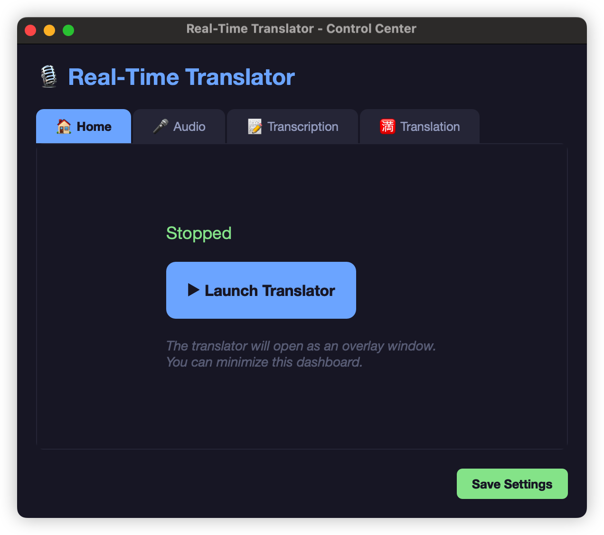

# live-speech-captions

Ứng dụng phụ đề thời gian thực: nhận giọng nói (ASR) và dịch sang ngôn ngữ đích, hiển thị trên overlay trong suốt cho macOS và Windows.

**GitHub:** https://github.com/xdnguyenhiepxd/live-speech-captions  
**Tác giả:** [Nguyễn Văn Hiệp (@xdnguyenhiepxd)](https://github.com/xdnguyenhiepxd)

## Tính năng

- **Nhận giọng thời gian thực**: `faster-whisper`, `mlx-whisper` (Apple Silicon), hoặc FunASR
- **Chữ to — chỉ nhận giọng**: tiếng Anh → chữ Anh, chạy theo khi nói, **không cần API**
- **Phụ đề + dịch**: nhận giọng local + dịch qua API (DeepSeek, ChatGPT, Gemini, …)
- **Overlay**: cửa sổ luôn nổi trên cùng, có thể kéo / đổi kích thước
- **Lưu transcript** vào thư mục `transcripts/`



---

## Cài đặt trên MacBook Air mới (hướng dẫn chi tiết)

Hướng dẫn này dà cho **MacBook Air mới tinh** (macOS mới cài, chưa có Homebrew / Python dev). MacBook Air đời gần đây dùng chip **Apple Silicon (M1/M2/M3/M4)** — app chạy tốt với backend **MLX**.

**Thời gian ước tính:** 30–60 phút lần đầu (tải Homebrew, thư viện Python, model Whisper ~ vài trăm MB).

### Bạn cần gì?

| Mục | Bắt buộc? | Ghi chú |
|-----|-----------|---------|
| Kết nối Internet | Có | Tải tool, model, dependency |
| Tài khoản macOS (đăng nhập máy) | Có | Cài driver, quyền micro |
| API key (DeepSeek, …) | **Không** nếu chỉ dùng **Chữ to** | Chỉ cần khi bật **Phụ đề + dịch** |
| BlackHole | Khuyến nghị | Bắt tiếng YouTube / Zoom phát ra loa; chỉ dùng mic thì có thể bỏ qua |

---

### Phần A — Thiết lập máy Mac lần đầu

#### A1. Mở Terminal

1. Nhấn **⌘ + Space**, gõ `Terminal`, Enter.  
2. Hoặc: **Finder → Ứng dụng → Tiện ích → Terminal**.

Giữ cửa sổ Terminal mở trong các bước sau (có thể thu nhỏ).

#### A2. Cài công cụ dòng lệnh của Apple (nếu được hỏi)

Lần đầu chạy lệnh `git` hoặc `brew`, macOS có thể hiện hộp thoại cài **Xcode Command Line Tools**:

```bash
xcode-select --install
```

Bấm **Install** và đợi xong (5–15 phút). Bỏ qua bước này nếu máy báo đã cài.

#### A3. Cài Homebrew

Homebrew giúp cài Python, FFmpeg, BlackHole bằng một lệnh.

Dán vào Terminal (lệnh chính thức từ [brew.sh](https://brew.sh)):

```bash
/bin/bash -c "$(curl -fsSL https://raw.githubusercontent.com/Homebrew/install/HEAD/install.sh)"
```

- Nhập **mật khẩu đăng nhập Mac** khi được hỏi (chữ không hiện khi gõ — bình thường).  
- Cuối quá trình, terminal có thể in thêm 2 dòng lệnh kiểu `echo 'eval "$(/opt/homebrew/bin/brew shellenv)"' >> ...` — **chạy đúng 2 dòng đó** (Homebrew trên chip Apple thường nằm ở `/opt/homebrew`).

Kiểm tra:

```bash
brew --version
```

Thấy số phiên bản (ví dụ `Homebrew 4.x`) là được.

#### A4. Cài Python, FFmpeg, BlackHole

```bash
brew install python ffmpeg blackhole-2ch git
```

| Gói | Vai trò |
|-----|---------|
| **python** | Chạy ứng dụng |
| **ffmpeg** | Xử lý file âm thanh cho Whisper |
| **blackhole-2ch** | Driver ảo — bắt âm từ loa máy (YouTube, họp online) |
| **git** | Tải mã nguồn từ GitHub |

Khi cài **blackhole-2ch**, macOS có thể mở file `.pkg` — bấm **Tiếp / Install**, nhập mật khẩu. **Khuyến nghị khởi động lại Mac** sau khi cài BlackHole lần đầu.

(Tùy chọn) `brew install switchaudio-osx` — đổi thiết bị ra mặc định từ app.

Kiểm tra nhanh:

```bash
python3 --version    # cần 3.10 trở lên
ffmpeg -version
```

---

### Phần B — Tải và cài ứng dụng

#### B1. Chọn thư mục làm việc

Ví dụ thư mục `Projects` trong nhà bạn:

```bash
mkdir -p ~/Projects
cd ~/Projects
```

#### B2. Clone mã nguồn

**Cách 1 — HTTPS (dễ trên máy mới, không cần SSH):**

```bash
git clone https://github.com/xdnguyenhiepxd/live-speech-captions.git
cd live-speech-captions
```

**Cách 2 — SSH** (nếu đã cấu hình khóa GitHub):

```bash
git clone git@github.com:xdnguyenhiepxd/live-speech-captions.git
cd live-speech-captions
```

#### B3. Cài thư viện Python (môi trường ảo)

```bash
chmod +x install_mac.sh start_mac.sh
./install_mac.sh
```

Script sẽ:

1. Tạo thư mục `.venv` (Python riêng cho project, không làm bẩn macOS).  
2. Cài toàn bộ `requirements.txt`.  
3. Trên **Apple Silicon** tự cài thêm **mlx-whisper** (nhận giọng nhanh trên GPU Mac).  
4. Báo cảnh báo nếu thiếu FFmpeg hoặc BlackHole.

Đợi đến dòng **Installation Complete!** (5–20 phút tùy mạng).

#### B4. Tạo file cấu hình `config.ini`

**Chỉ nhận giọng tiếng Anh (Chữ to) — không cần API:**

Sao chép mẫu tối giản rồi chỉnh (hoặc tạo tay theo block dưới):

```bash
cp config.ini.example config.ini
```

Mở `config.ini` bằng TextEdit hoặc Cursor/VS Code. Ví dụ cấu hình gợi ý cho MacBook Air + tiếng Anh + Chữ to:

```ini
[api]
base_url = https://api.deepseek.com
api_key = dummy-key-not-used-for-reader-mode

[translation]
model = deepseek-chat
target_lang = Vietnamese
threads = 2

[display]
reader_font_size = 32
reader_window_width = 920
reader_keep_lines = 50

[transcription]
backend = mlx
whisper_model = small.en
source_language = en
device = auto
compute_type = float16

[audio]
device_index = auto
sample_rate = 16000
silence_threshold = 0.005
silence_duration = 0.45
max_phrase_duration = 6
streaming_mode = true
streaming_step_size = 0.2
reader_partial_updates = true
reader_update_interval = 0.85
partial_window_seconds = 2.5
```

> **Lưu ý:** `api_key` không dùng khi chỉ bấm **Chữ to**. Nếu sau này dùng **Phụ đề + dịch**, copy mẫu có API thật:  
> `cp config/mac/deepseek.ini.example config.ini` rồi sửa `api_key`.

**Không** đưa `config.ini` (có key thật) lên GitHub — file này đã nằm trong `.gitignore`.

---

### Phần C — Âm thanh trên MacBook Air

#### Trường hợp 1: Chỉ nói / dùng mic tích hợp (đơn giản nhất)

1. Không bắt buộc BlackHole.  
2. Trong app: tab **Âm thanh** → **Thiết bị vào** = **Micrô MacBook Air** (hoặc tên mic tương tự).  
3. **Lưu cấu hình** → chạy **Chữ to**.

#### Trường hợp 2: Nghe YouTube / Zoom / video trên loa máy (cần BlackHole)

Mục tiêu: **vừa nghe qua loa Air**, **vừa** gửi âm vào app.

**Bước C1 — Kiểm tra BlackHole đã có**

Mở **Thiết bị Âm thanh** (gõ Spotlight: `Audio MIDI Setup` hoặc tiếng Việt **Cài đặt âm thanh MIDI**).

Sidebar phải thấy dòng **BlackHole 2ch**. Nếu không thấy → xem [BlackHole không hiện](#blackhole-cài-rồi-không-thấy-trong-thiết-bị-âm-thanh).

**Bước C2 — Tạo Multi-Output Device**

1. Trong **Thiết bị Âm thanh**, góc dưới trái bấm **+** → **Create Multi-Output Device** / **Tạo thiết bị nhiều đầu ra**.  
2. Tick **Sử dụng** cho:
   - **Loa MacBook Air** (hoặc tai nghe bạn đang dùng)
   - **BlackHole 2ch**
3. **Điều chỉnh Trôi (Drift Correction):** **bỏ tick** trên **Loa MacBook**; BlackHole để trôi tắt.

Minh họa:  · 

**Bước C3 — Đặt đầu ra hệ thống (bước hay bị bỏ sót)**

**Cài đặt hệ thống → Âm thanh → Đầu ra** → chọn **Thiết bị Nhiều Đầu ra** / **Multi-Output Device** (không chọn chỉ «Loa MacBook Air»).

Quay lại Thiết bị Âm thanh: biểu tượng **loa** phải nằm cạnh Multi-Output, không chỉ cạnh loa MacBook.

**Bước C4 — Trong app**

Tab **Âm thanh** → **Thiết bị vào** = **[x] BlackHole 2ch** → **Lưu cấu hình**.

---

### Phần D — Quyền riêng tư macOS (lần đầu chạy)

Khi chạy `./start_mac.sh` và bấm **Chữ to**, macOS có thể hỏi quyền:

| Quyền | Đường dẫn | Bật cho |
|--------|-----------|---------|
| **Microphone / Micrô** | Cài đặt hệ thống → Quyền riêng tư & Bảo mật → Micrô | **Terminal** hoặc **Python** |
| **Accessibility / Trợ năng** | … → Trợ năng | Terminal (nếu dùng tab quản lý thiết bị) |

Nếu từ chối nhầm: tắt app, vào Cài đặt bật lại, chạy `./start_mac.sh` lần nữa.

---

### Phần E — Chạy ứng dụng lần đầu

```bash
cd ~/Projects/live-speech-captions
./start_mac.sh
```

Terminal hiện `[Khởi động] Chạy ứng dụng (hot reload)...` — **giữ cửa sổ Terminal mở** khi đang dùng app.

1. Cửa sổ **Bảng điều khiển** (tiếng Việt) mở ra.  
2. Kiểm tra tab **Nhận giọng**: `backend = mlx`, `whisper_model = small.en` (hoặc `tiny.en` nhanh hơn), `source_language = en`.  
3. Tab **Trang chủ** → **🔤 Chữ to — chỉ nhận giọng**.  
4. **Lần đầu:** terminal có thể hiện đang tải model (`Fetching ... files`) — đợi 2–10 phút.  
5. Cửa sổ **chữ to** xuất hiện; phát YouTube tiếng Anh hoặc nói thử — chữ cập nhật ở khung **Đang nói**, câu xong lên **Lịch sử**.

**Dừng app:** bấm **⏹** trên overlay, hoặc đóng Bảng điều khiển, hoặc `Ctrl+C` trong Terminal.

---

### Phần F — Các lần sau (máy đã cài rồi)

Mỗi khi bật Mac, chỉ cần:

```bash
cd ~/Projects/live-speech-captions
./start_mac.sh
```

Chỉ chạy lại `./install_mac.sh` khi:

- Xóa nhầm thư mục `.venv`
- Cập nhật project (`git pull`) có thay đổi `requirements.txt`
- Đổi phiên bản Python / macOS lớn

---

### Phần G — Cài trên MacBook khác (máy của bạn bè / máy thứ hai)

**Không** copy nguyên thư mục `.venv` sang máy khác (thường lỗi).

Trên **mỗi** Mac mới:

1. Làm lại **Phần A** (Homebrew, python, ffmpeg, blackhole).  
2. `git clone` + `./install_mac.sh`.  
3. Copy `config.ini` (USB / AirDrop / cloud) **hoặc** tạo lại từ `config.ini.example`.  
4. Cấu hình lại Multi-Output + quyền Micro.  
5. `./start_mac.sh`.

Mac **Intel** (hiếm trên Air mới): trong `config.ini` đổi `backend = whisper`, `device = cpu` (không dùng `mlx`).

**Chưa có file `.app` cài kéo vào Applications** — hiện chạy bằng script như trên.

---

### Phần H — Hai chế độ sử dụng

| Nút | Chức năng | Cần API? |
|-----|-----------|----------|
| **🔤 Chữ to — chỉ nhận giọng** | Tiếng Anh → chữ Anh, chạy theo | **Không** |
| **▶ Phụ đề + dịch** | Nhận giọng + dịch (VD tiếng Việt) | **Có** (`api_key`, `base_url`) |

---

### Phần I — Xử lý sự cố (MacBook Air)

| Triệu chứng | Cách xử lý |
|-------------|------------|
| `command not found: brew` | Chạy lại bước A3; thêm `eval "$(/opt/homebrew/bin/brew shellenv)"` vào `~/.zprofile` |
| `Chưa có môi trường ảo .venv` | `cd` vào thư mục project → `./install_mac.sh` |
| Không có chữ / log `RMS=0.0000` | Đặt **Đầu ra** = Multi-Output; app chọn **BlackHole 2ch** làm thiết bị vào |
| Có tiếng loa nhưng app im lặng | Xem C3 — output hệ thống chưa trỏ Multi-Output |
| Chữ chậm / giật | Đổi `whisper_model = tiny.en`; tăng `reader_update_interval = 1.2` trong `config.ini` |
| Model tải lâu | Bình thường lần đầu; cần Wi‑Fi ổn định |
| App thoát sau sửa `config.ini` | Hot reload — chạy lại `./start_mac.sh` |
| Dịch lỗi 401 | Chỉ liên quan **Phụ đề + dịch** — kiểm tra `api_key` |

#### BlackHole cài rồi không thấy trong Thiết bị Âm thanh

1. Chạy lại installer (đường dẫn có thể khác phiên bản):

   ```bash
   open /opt/homebrew/Caskroom/blackhole-2ch/*/BlackHole2ch*.pkg
   ```

2. **Khởi động lại Mac.**

3. Hoặc:

   ```bash
   sudo killall coreaudiod
   ```

   Đóng/mở lại Thiết bị Âm thanh.

4. Kiểm tra:

   ```bash
   system_profiler SPAudioDataType | grep -i blackhole
   ```

5. macOS Sequoia trở lên: **Cài đặt hệ thống → Quyền riêng tư & Bảo mật** — cho phép phần mềm hệ thống nếu bị chặn.

Tải tay: [existential.audio/blackhole](https://existential.audio/blackhole/)

---

## Cấu hình `config.ini` (tham chiếu)

| Section | Tham số | Ghi chú |
|---------|---------|---------|
| `[transcription]` | `backend`, `whisper_model`, `source_language` | Mac Air M-series: `mlx` + `tiny.en` / `small.en` + `en` |
| `[audio]` | `device_index`, `silence_threshold`, `reader_update_interval`, … | `device_index = auto` → tự tìm BlackHole |
| `[display]` | `reader_font_size`, `reader_keep_lines` | Giao diện Chữ to |
| `[api]` / `[translation]` | Chỉ khi dịch | Xem `config/README.md` |

Mẫu theo nhà cung cấp API: `config/mac/*.ini.example` — `cp config/mac/deepseek.ini.example config.ini`

**Bảo mật:** Không commit `config.ini` lên Git.

Chi tiết FunASR: `FUNASR_GUIDE.md`

---

## Windows (tóm tắt)

1. Python 3.10+, FFmpeg, [VB-CABLE](https://vb-audio.com/Cable/) (tùy chọn).  
2. `install_windows.bat` → copy `config\windows\*.ini.example` → `config.ini`.  
3. `start_windows.bat` — không có MLX; dùng `backend = whisper`, `device = cpu` hoặc `cuda` nếu có GPU NVIDIA.

---

## License

MIT — Copyright 2025 Nguyễn Văn Hiệp
